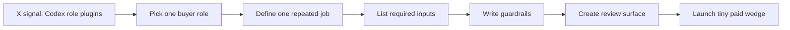

# Vertical Agent Template Kit Workflow

```mermaid
flowchart LR
  X[X signal: Codex role plugins] --> R[Pick one buyer role]
  R --> J[Define one repeated job]
  J --> I[List required inputs]
  I --> G[Write guardrails]
  G --> V[Create review surface]
  V --> L[Launch tiny paid wedge]
```

**Rule:** sell a job-specific workflow first; generalize only after repeated usage.
